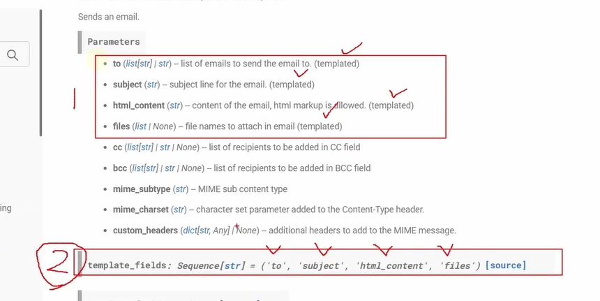
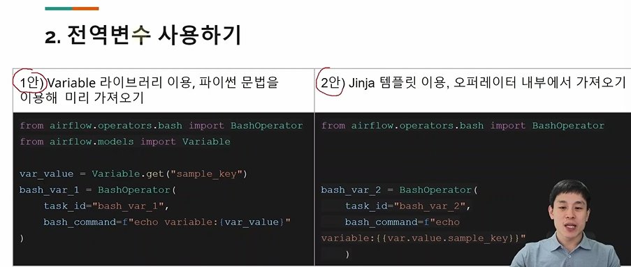

# 학습 기록
## Python & email 오퍼레이터간 Xcom 사용
- 복습: xcom이란 task 간에 데이터를 주고 받는 방법 (일종의 함수)

- Python -> Email 오퍼레이터 Xcom 전달하는 법
Python에서 데이터 전달: task 함수의 리턴 값으로 보내면 됨
Email에서 데이터 수신: html_content 등 template 사용 가능한 파라미터에서 ti.xcom_pull 함수 사용함 (템플릿 jinja)

- python 오퍼레이터의 결과값

## 전역 공유 변수 variable 사용하기
- 모든 dag에서 접근 가능한 변수
variable
- xcom: 특정 DAG, 특정 Schedule에 수행되는 tAsk 간에만 공유된다. 
- localhost:8080 > admin > variables > (key, val, description) 등록
- 메타 DB의 variable 테이블에 저장된다. 

- 전역변수 사용하는 법
1) variable 라이브러리 이용해서 파이썬 문법 이용해 미리 가져오기
var = Variable.get("sample_key")
2) jinja 템플릿을 이용해서 var.value.sample_key (var이 variable 변수에 접근하는 것)
권고안은 2안이다. 
스케줄러의 주기적 DAG 파싱시, Variable.get 개수 만큼 DB 연결을 일으켜 불필요한 부하를 발생시킨다. 
스케줄러 과부하 원인 중 하나가 됨

- 전역 변수는 언제, 어떻게 쓰면 좋을까
-> 협업 환경에서 표준화된 dag을 만들기 위해 사용함
const로 지정해서 사용할 변수들 셋팅

## Task 분기 처리하기 - With BranchPythonOperator
- Task 분기 처리 방법
 앞선 task 수행 결과에 따라, 여러 taks 중 하나만 수행하도록 구성하고 싶을 때 유용 

- 구현 방법 세가지
1) BranchPythonOperator: 오늘 실습은 이렇게
2) task.branch 데코레이터 이용
3) BaseBranchOperator 상속시켜서 직접 개발하기

- BranchPythonOperator
BranchPythonOperator(
    task_id, 
    python_callable (여기에 task 선택 로직을 구현)
)

## Task 분기처리하기 - with task.branch
- task.branch decorator가 있다 @task.branch
